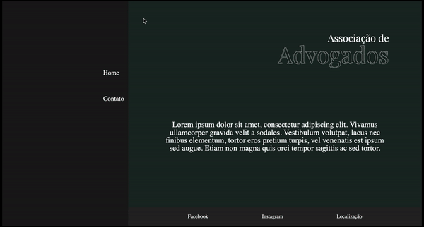

# Contato Associação

## Descrição

O projeto desenvolvido é um website de uma associação de advogados onde seu principal objetivo é o acesso dos clientes aos associados.

## Objetivo

- `Aplicar formulário`
- `Desenvolver UI`
- `Conectar páginas`

## Tecnologias utilizadas

- `HTML5`
- `CSS3`

## Link de demonstração

> https://marianwiermann.github.io/AdvogadoContato/
